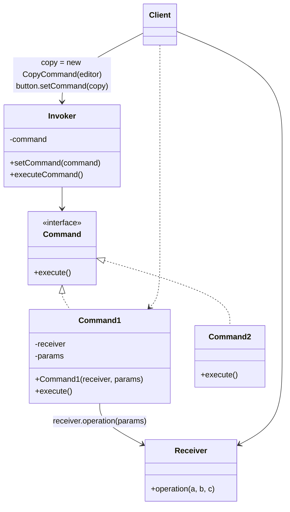

```mermaid
classDiagram
  direction TB
  class Client
  class Invoker {
      -command
      +setCommand(command)
      +executeCommand()
  }
  
  class Command {
      <<interface>>
      +execute()
  }

  class Command1 {
      -receiver
      -params
      +Command1(receiver, params)
      +execute()
  }

  class Command2 {
      +execute()
  }

  class Receiver {
      +operation(a, b, c)
  }
  
 
  Invoker --> Command
  Command <|.. Command1 
  Command1 --> Receiver : receiver.operation(params)
  Command <|.. Command2

  Client --> Invoker : copy = new CopyCommand(editor)</br>button.setCommand(copy) 
  Client ..> Command1
  Client --> Receiver

```