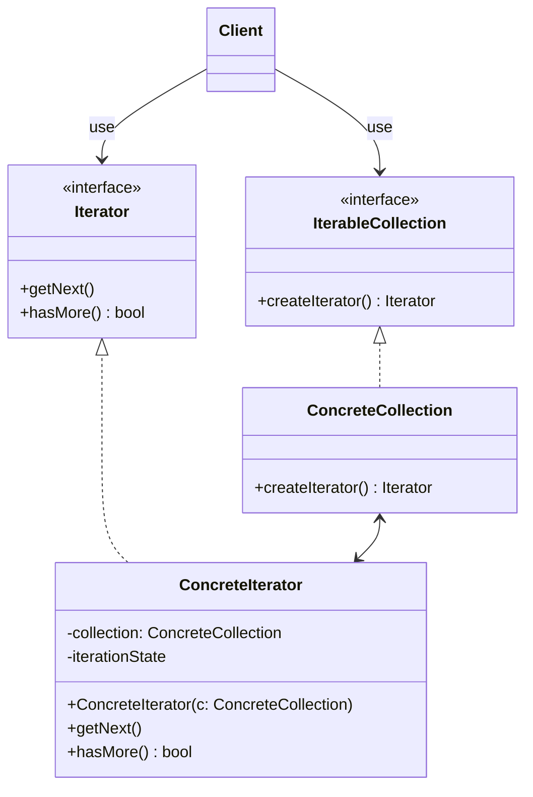

```mermaid
classDiagram
direction BT
    class Client
    class Iterator {
        <<interface>>
        +getNext()
        +hasMore() bool
    }
    class IterableCollection {
        <<interface>>
        +createIterator() Iterator
    }
    class ConcreteIterator {
        -collection: ConcreteCollection
        -iterationState
        +ConcreteIterator(c: ConcreteCollection)
        +getNext()
        +hasMore() bool
    }
    class ConcreteCollection {
        +createIterator() Iterator
    }
    Iterator <-- Client: use
    IterableCollection <-- Client: use
    ConcreteIterator ..|> Iterator
    ConcreteCollection ..|> IterableCollection
    ConcreteIterator <--> ConcreteCollection

```