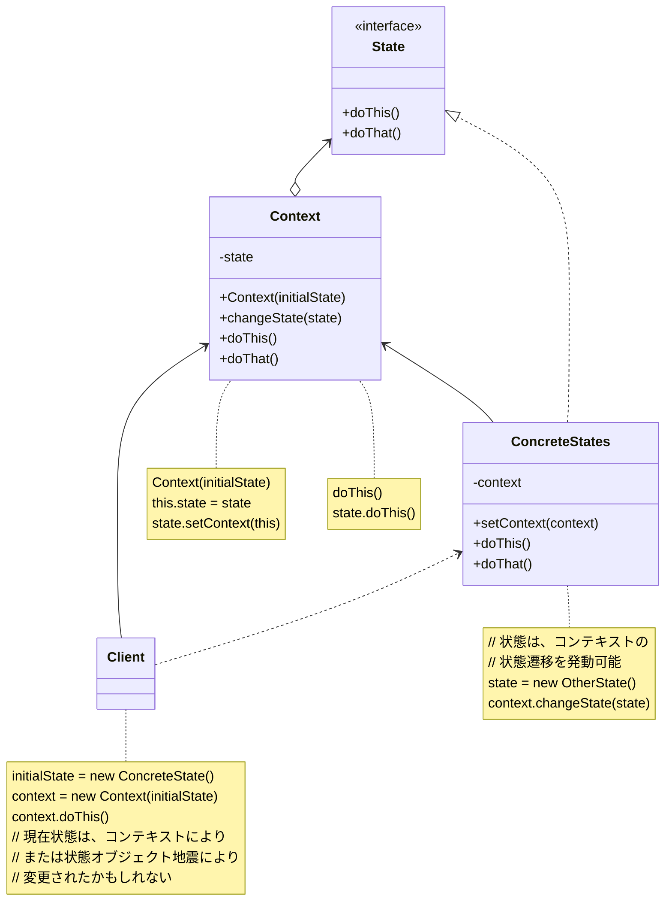

```mermaid
classDiagram
  direction BT
  class Context {
      -state
      +Context(initialState)
      +changeState(state)
      +doThis()
      +doThat()
  }
  note for Context "Context(initialState)
  this.state = state
  state.setContext(this)"
  note for Context "doThis()
  state.doThis()"
  class State {
      <<interface>>
      +doThis()
      +doThat()
  }
  class ConcreteStates {
      -context
      +setContext(context)
      +doThis()
      +doThat()
  }
note for ConcreteStates "// 状態は、コンテキストの
// 状態遷移を発動可能
state = new OtherState()
context.changeState(state)"

  class Client
  note for Client "initialState = new ConcreteState()
  context = new Context(initialState)
  context.doThis()
  // 現在状態は、コンテキストにより
  // または状態オブジェクト地震により
  // 変更されたかもしれない"

  Context o--> State
  ConcreteStates ..|> State
  ConcreteStates --> Context
  Client ..> ConcreteStates
  Client --> Context

```