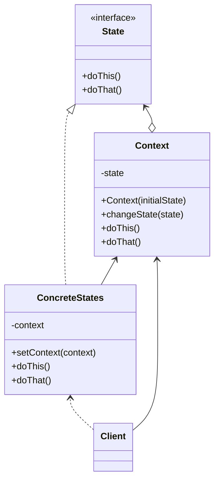

```mermaid
classDiagram
  direction BT
  class Context {
      -state
      +Context(initialState)
      +changeState(state)
      +doThis()
      +doThat()
  }
  class State {
      <<interface>>
      +doThis()
      +doThat()
  }
  class ConcreteStates {
      -context
      +setContext(context)
      +doThis()
      +doThat()
  }
  class Client

  Context o--> State
  ConcreteStates ..|> State
  ConcreteStates --> Context
  Client ..> ConcreteStates
  Client --> Context

```