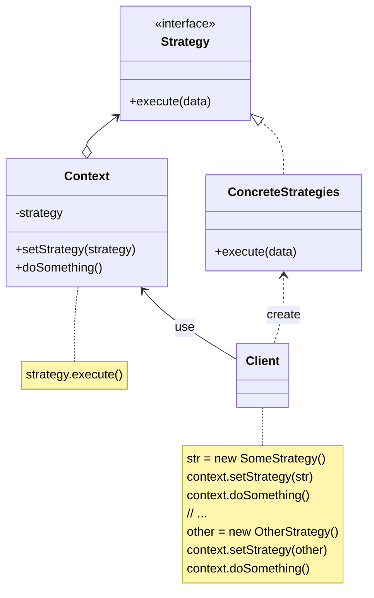

```mermaid
classDiagram
  direction BT
  class Client
  note for Client "str = new SomeStrategy()
  context.setStrategy(str)
  context.doSomething()
  // ...
  other = new OtherStrategy()
  context.setStrategy(other)
  context.doSomething()"
  class Context{
    -strategy
    +setStrategy(strategy)
    +doSomething()
  }
  note for Context "strategy.execute()"
  class Strategy{
    <<interface>>
    +execute(data)
  }
  class ConcreteStrategies{
    +execute(data)
  }
  Context o--> Strategy
  Client --> Context: use
  Client ..> ConcreteStrategies: create
  ConcreteStrategies ..|> Strategy

```