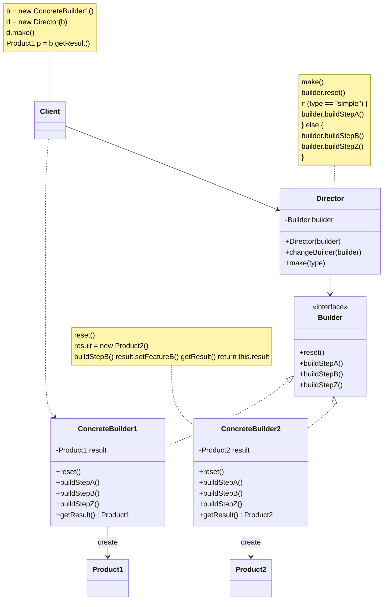

```mermaid
classDiagram
   direction TB
    class Client
    note for Client "b = new ConcreteBuilder1()
    d = new Director(b)
    d.make()
    Product1 p = b.getResult()"
    class Builder {
        <<interface>>
        +reset()
        +buildStepA()
        +buildStepB()
        +buildStepZ()
    }

    class ConcreteBuilder1 {
        -Product1 result
        +reset()
        +buildStepA()
        +buildStepB()
        +buildStepZ()
        +getResult() Product1
    }

    class ConcreteBuilder2 {
        -Product2 result
        +reset()
        +buildStepA()
        +buildStepB()
        +buildStepZ()
        +getResult() Product2
    }

    note for ConcreteBuilder2 "reset()
    result = new Product2()
    
    buildStepB()
    result.setFeatureB()
    
    getResult()
    return this.result"

    class Director {
        -Builder builder
        +Director(builder)
        +changeBuilder(builder)
        +make(type)
    }

    note for Director "make()
    builder.reset()
    if (type == &quot;simple&quot;) {
        builder.buildStepA()
    } else {
        builder.buildStepB()
        builder.buildStepZ()
    }
    "

    class Product1
    class Product2

    Client ..> ConcreteBuilder1
    Client --> Director
    Director --> Builder
    Builder <|.. ConcreteBuilder1
    Builder <|.. ConcreteBuilder2
    ConcreteBuilder1 --> Product1:create
    ConcreteBuilder2 --> Product2:create

```