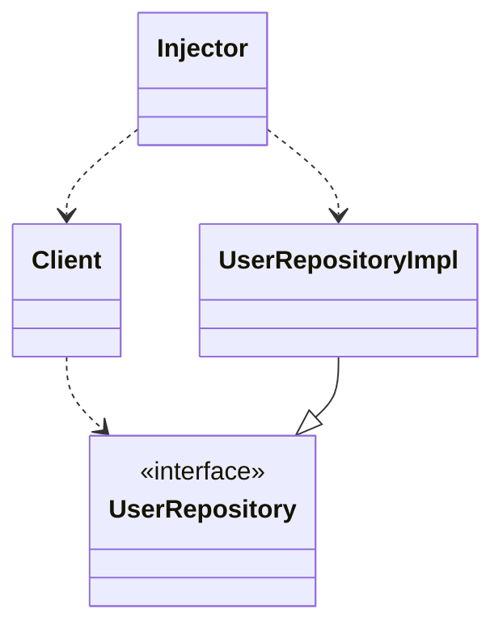

```mermaid
classDiagram
   direction TB
    class Client

    class Injector{
    }

    class UserRepository {
        <<interface>>
    }

    class UserRepositoryImpl {
    }


    Client ..> UserRepository
    Injector ..> Client
    Injector ..> UserRepositoryImpl
    UserRepositoryImpl --|> UserRepository

```