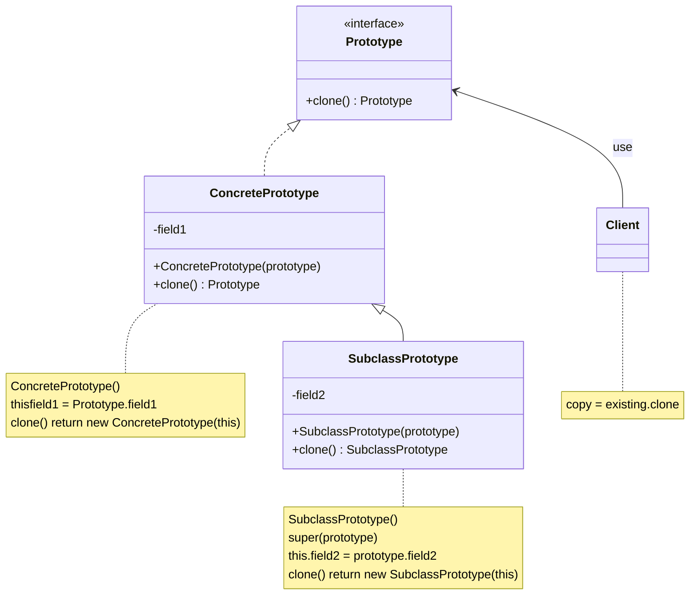

```mermaid
classDiagram
    direction BT
    class Prototype{
      <<interface>>
      +clone() Prototype
    }

    class ConcretePrototype{
      -field1
      +ConcretePrototype(prototype)
      +clone() Prototype
    }
    note for ConcretePrototype "ConcretePrototype()
    thisfield1 = Prototype.field1
    
    clone()
    return new ConcretePrototype(this)"

    class SubclassPrototype{
      -field2
      +SubclassPrototype(prototype)
      +clone() SubclassPrototype
    }
    note for SubclassPrototype"SubclassPrototype()
    super(prototype)
    this.field2 = prototype.field2
    
    clone()
    return new SubclassPrototype(this)"

    class Client
    note for Client "copy = existing.clone"
    SubclassPrototype --|> ConcretePrototype
    ConcretePrototype ..|> Prototype
    Client --> Prototype : use

```