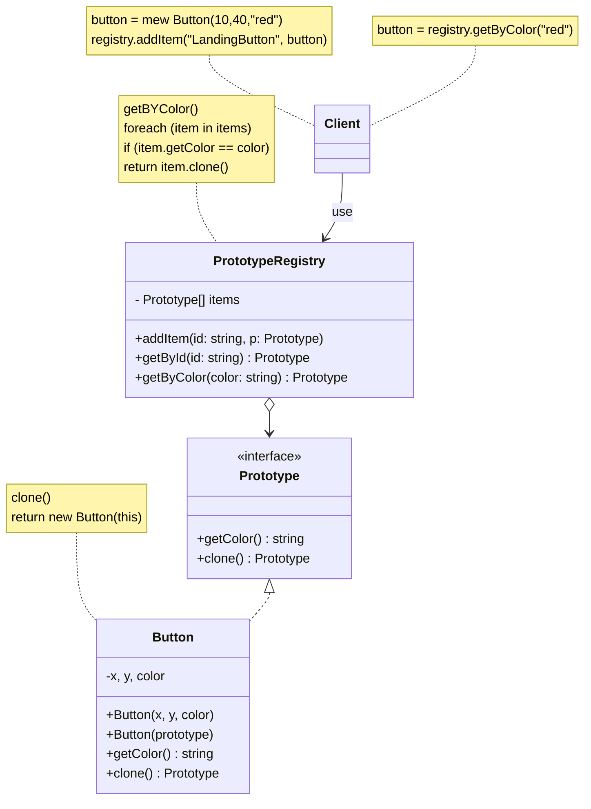

```mermaid
classDiagram
    direction TB
    class PrototypeRegistry{
        - Prototype[] items
        +addItem(id: string, p: Prototype)
        +getById(id: string) Prototype
        +getByColor(color: string) Prototype
    }
    note for PrototypeRegistry"getBYColor()
    foreach (item in items)
      if (item.getColor == color)
        return item.clone()"

    class Prototype{
        <<interface>>
        +getColor() string
        +clone() Prototype
    }

    class Button{
        -x, y, color
        +Button(x, y, color)
        +Button(prototype)
        +getColor() string
        +clone() Prototype
    }

    note for Button "clone()
    return new Button(this)"
    
    class Client

    note for Client "button = mew Button(10,40,&quot;red&quot;)
    registry.addItem(&quot;LandingButton&quot;, button)"
    note for Client "button = registry.getByColor(&quot;red&quot;)"
    

    PrototypeRegistry o--> Prototype
    Prototype <|.. Button 
    
    Client --> PrototypeRegistry : use 

```