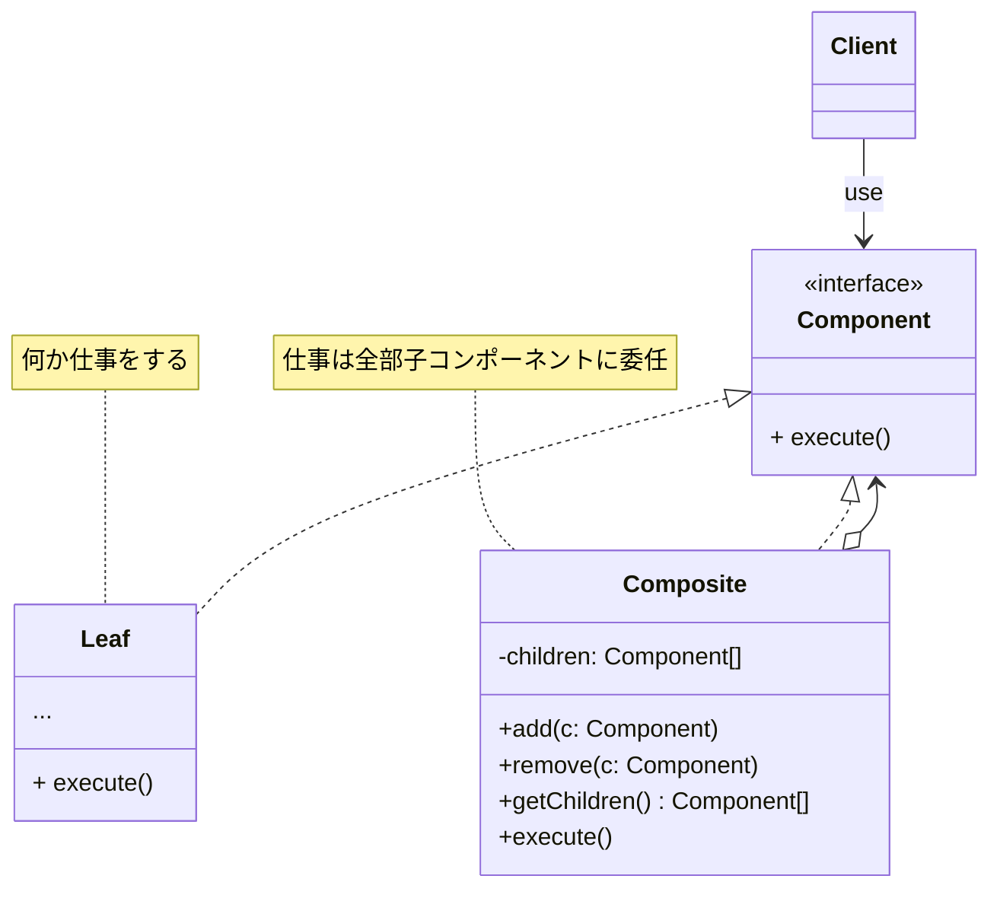

```mermaid
classDiagram
    direction TB
    class Client
    class Component {
        <<interface>>
        + execute()
    }


    class Leaf {
        ...
        + execute()
    }
    note for Leaf "何か仕事をする"

    class Composite {
        -children: Component[]
        +add(c: Component)
        +remove(c: Component)
        +getChildren() Component[]
        +execute()
    }
    note for Composite "仕事は全部子コンポーネントに委任"
 
    Client --> Component:use
    Component <|.. Leaf
    Component <|.. Composite 
    Component <--o Composite 

```