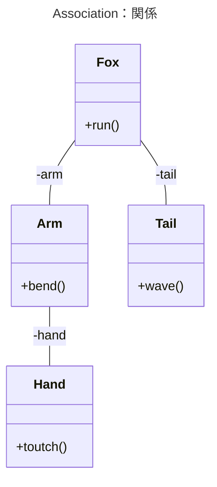

```mermaid
---
title: Association：関係
config:
---
classDiagram
    direction TB
 
    class Fox {
        +run()
    }


    class Arm {
        +bend()
    }

    class Hand {
        +toutch()
    }

    class Tail {
        +wave()
    }


 
    Fox -- Tail:-tail
    Fox -- Arm:-arm
    Arm -- Hand:-hand

```