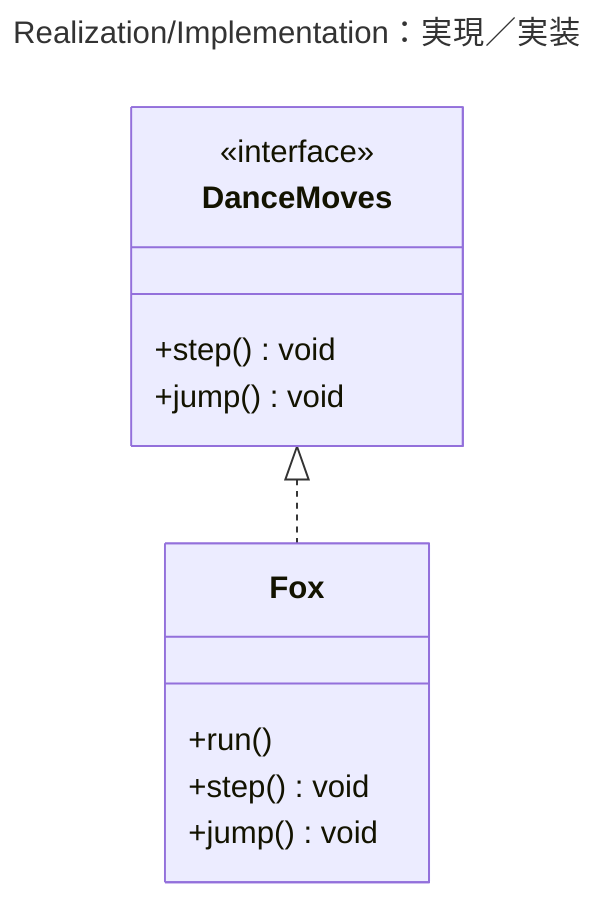

```mermaid
---
title: Realization/Implementation：実現／実装
config:
---
classDiagram
    direction TB

    class DanceMoves {
        <<interface>>
        +step() void
        +jump() void

    }

    class Fox {
        +run()
        +step() void
        +jump() void
    }


 
    DanceMoves <|.. Fox

```