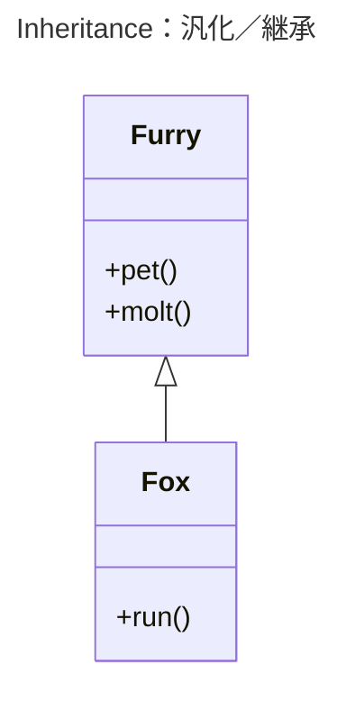

```mermaid
---
title: Inheritance：汎化／継承
config:
---
classDiagram
    direction TB
 
    class Furry {
        +pet()
        +molt()
    }


    class Fox {
        +run()
    }

    Furry <|-- Fox


```