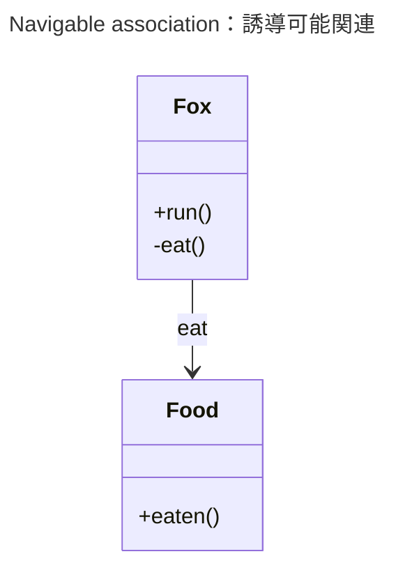

```mermaid
---
title: Navigable association：誘導可能関連
config:
---
classDiagram
    direction TB
 
    class Fox {
        +run()
        -eat()
    }


    class Food {
        +eaten()
    }

 
    Fox --> Food:eat

```